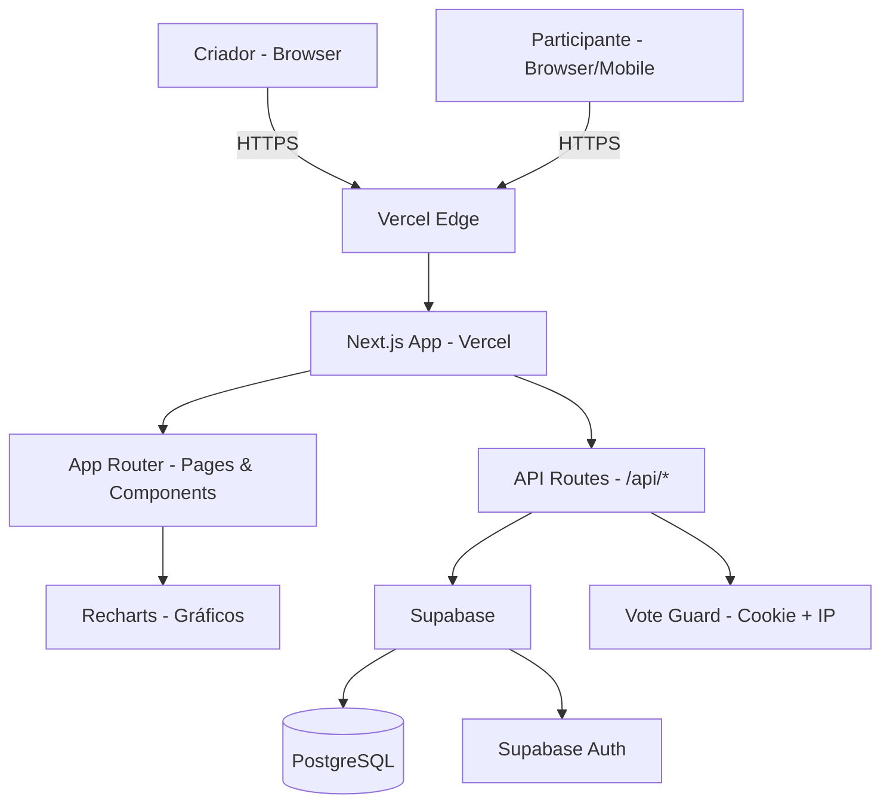
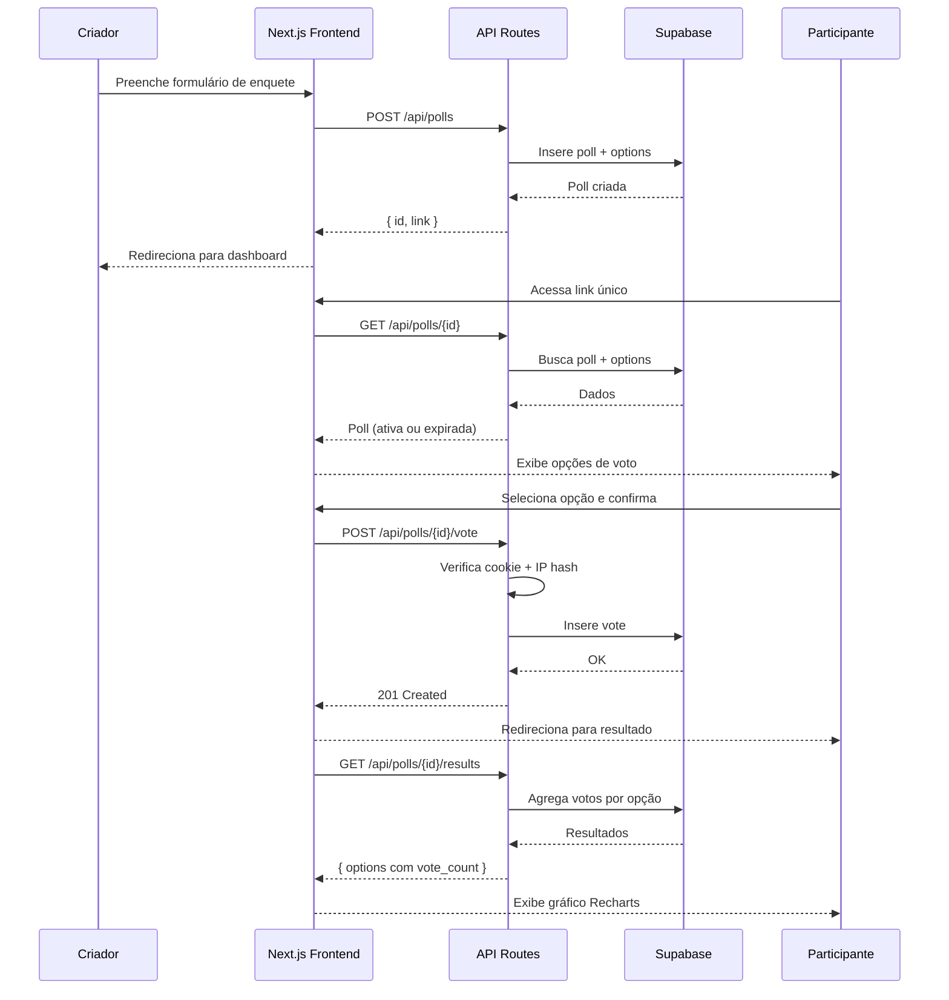

# Aplicação de Enquetes — Fullstack Architecture Document

**Versão:** 1.0
**Data:** 2026-03-22
**Autor:** Aria (@architect)
**Status:** Aprovado

---

## Change Log

| Data | Versão | Descrição | Autor |
|------|--------|-----------|-------|
| 2026-03-22 | 1.0 | Criação inicial | Aria (@architect) |

---

## 1. Introduction

Esta arquitetura cobre frontend, backend e infraestrutura para a Aplicação de Enquetes, servindo como fonte única de verdade para o desenvolvimento fullstack. Combina arquitetura de frontend e backend em um documento unificado, adequado para desenvolvimento com agentes de IA.

**Starter Template:** N/A — Greenfield project

---

## 2. High Level Architecture

### Technical Summary

Aplicação fullstack monolítica baseada em Next.js 14 (App Router), com frontend e API Routes unificados em um único repositório. O Supabase provê banco de dados PostgreSQL, autenticação e realtime. O deploy ocorre na Vercel com edge functions para baixa latência global. O controle de voto único por participante é feito via combinação de cookie + validação de IP no backend. Os resultados são exibidos com Recharts sem necessidade de WebSocket — polling simples é suficiente para o MVP.

### Platform & Infrastructure

**Plataforma:** Vercel + Supabase

**Key Services:**
- Vercel: deploy zero-config para Next.js, CDN global, preview environments automáticos
- Supabase: PostgreSQL gerenciado, Auth, free tier generoso

**Deployment:** Vercel (global edge network)

> Alternativas descartadas: AWS (complexidade desnecessária para MVP), Railway (menos integrado com Next.js).

### Repository Structure

**Structure:** Monorepo simples (npm workspaces)

```
aula-04/
├── app/          # Next.js (frontend + API Routes)
├── supabase/     # Migrations e configurações
└── docs/         # PRD, arquitetura, stories
```

### High Level Architecture Diagram



### Architectural Patterns

- **Monolith Fullstack (Next.js):** Frontend e backend no mesmo codebase — reduz complexidade operacional para MVP
- **Server Components + API Routes:** Páginas públicas server-rendered para SEO e performance; mutations via API Routes
- **Repository Pattern:** Acesso ao banco centralizado em `lib/db/` — desacopla lógica de negócio do Supabase
- **Cookie + IP Vote Guard:** Controle de voto único sem cadastro — cookie persistente + validação de IP como fallback

---

## 3. Tech Stack

| Categoria | Tecnologia | Versão | Propósito | Rationale |
|-----------|-----------|--------|-----------|-----------|
| Frontend Language | TypeScript | 5.x | Tipagem estática | Type safety end-to-end |
| Frontend Framework | Next.js | 14.x | App Router, SSR, API Routes | Fullstack unificado, deploy Vercel |
| UI Component Library | shadcn/ui | latest | Componentes acessíveis | WCAG AA, baseado em Radix UI |
| State Management | React Server Components + useState | built-in | Estado local e server state | Sem over-engineering para MVP |
| Backend Language | TypeScript | 5.x | API Routes tipadas | Consistência com frontend |
| Backend Framework | Next.js API Routes | 14.x | Endpoints REST | Integrado ao framework |
| API Style | REST | — | CRUD de enquetes e votos | Simples, bem suportado |
| Banco de Dados | Supabase (PostgreSQL) | 15.x | Persistência principal | Auth incluído, free tier |
| Cache | — | — | N/A no MVP | Polling simples suficiente |
| File Storage | — | — | N/A | Sem uploads no MVP |
| Autenticação | Supabase Auth | built-in | Login do criador | Integrado ao banco |
| Frontend Testing | Vitest + React Testing Library | latest | Unit tests de componentes | Rápido, integrado ao Vite |
| Backend Testing | Vitest | latest | Unit tests de API Routes | Mesma ferramenta |
| E2E Testing | Playwright | latest | Fluxos críticos | Confiável, multi-browser |
| Build Tool | Next.js (Turbopack) | built-in | Build otimizado | Zero-config |
| Bundler | Turbopack | built-in | Dev server rápido | Integrado ao Next.js 14 |
| IaC Tool | — | — | N/A | Vercel + Supabase gerenciados |
| CI/CD | GitHub Actions | — | Lint, test, deploy | Integrado ao GitHub |
| Monitoring | Vercel Analytics | built-in | Web vitals, erros | Free tier, zero-config |
| Logging | Console + Vercel Logs | built-in | Logs de API | Suficiente para MVP |
| CSS Framework | Tailwind CSS | 3.x | Estilização responsiva | Responsivo por padrão |
| Gráficos | Recharts | 2.x | Visualização dos votos | Leve, React-native |

---

## 4. Data Models

### User (Criador)

**Purpose:** Representa o criador autenticado — gerenciado pelo Supabase Auth.

```typescript
interface User {
  id: string;           // UUID - Supabase Auth
  email: string;
  created_at: string;   // ISO 8601
}
```

**Relationships:**
- User → Poll (1:N) — um criador possui muitas enquetes

---

### Poll (Enquete)

**Purpose:** Enquete criada pelo criador, com opções e data de expiração.

```typescript
interface Poll {
  id: string;           // UUID
  creator_id: string;   // FK → User.id
  title: string;
  expires_at: string;   // ISO 8601
  created_at: string;
  is_expired: boolean;  // computed: expires_at < now()
}
```

**Relationships:**
- Poll → User (N:1)
- Poll → Option (1:N)
- Poll → Vote (1:N)

---

### Option (Opção de Voto)

**Purpose:** Cada opção disponível para votação em uma enquete.

```typescript
interface Option {
  id: string;           // UUID
  poll_id: string;      // FK → Poll.id
  text: string;
  vote_count: number;   // computed via aggregate
}
```

**Relationships:**
- Option → Poll (N:1)
- Option → Vote (1:N)

---

### Vote (Voto)

**Purpose:** Registro de um voto, com controle de duplicidade por IP + cookie.

```typescript
interface Vote {
  id: string;           // UUID
  poll_id: string;      // FK → Poll.id
  option_id: string;    // FK → Option.id
  voter_hash: string;   // SHA256(ip + user_agent) — anonimizado
  created_at: string;
}
```

**Relationships:**
- Vote → Poll (N:1)
- Vote → Option (N:1)

---

## 5. API Specification

```yaml
openapi: 3.0.0
info:
  title: Enquetes API
  version: 1.0.0
  description: API REST para criação e votação em enquetes

servers:
  - url: /api
    description: Next.js API Routes

paths:
  /polls:
    get:
      summary: Listar enquetes do criador autenticado
      security: [BearerAuth]
      responses:
        200:
          description: Lista de enquetes
          content:
            application/json:
              schema:
                type: array
                items: { $ref: '#/components/schemas/Poll' }
    post:
      summary: Criar nova enquete
      security: [BearerAuth]
      requestBody:
        required: true
        content:
          application/json:
            schema:
              type: object
              required: [title, options, expires_at]
              properties:
                title: { type: string }
                options:
                  type: array
                  minItems: 2
                  maxItems: 10
                  items: { type: string }
                expires_at: { type: string, format: date-time }
      responses:
        201:
          description: Enquete criada

  /polls/{id}:
    get:
      summary: Buscar enquete por ID (público)
      parameters:
        - name: id
          in: path
          required: true
          schema: { type: string, format: uuid }
      responses:
        200:
          description: Dados da enquete com opções
        404:
          description: Enquete não encontrada

  /polls/{id}/results:
    get:
      summary: Resultados da enquete com contagem de votos
      parameters:
        - name: id
          in: path
          required: true
          schema: { type: string, format: uuid }
      responses:
        200:
          description: Resultados com votos por opção

  /polls/{id}/vote:
    post:
      summary: Registrar voto (público, sem autenticação)
      parameters:
        - name: id
          in: path
          required: true
          schema: { type: string, format: uuid }
      requestBody:
        required: true
        content:
          application/json:
            schema:
              type: object
              required: [option_id]
              properties:
                option_id: { type: string, format: uuid }
      responses:
        201:
          description: Voto registrado
        409:
          description: Participante já votou
        410:
          description: Enquete expirada

components:
  securitySchemes:
    BearerAuth:
      type: http
      scheme: bearer
  schemas:
    Poll:
      type: object
      properties:
        id: { type: string }
        title: { type: string }
        expires_at: { type: string }
        is_expired: { type: boolean }
        options:
          type: array
          items: { $ref: '#/components/schemas/Option' }
    Option:
      type: object
      properties:
        id: { type: string }
        text: { type: string }
        vote_count: { type: integer }
```

---

## 6. Core Workflows



---

## 7. Database Schema

```sql
-- Polls
CREATE TABLE polls (
  id UUID PRIMARY KEY DEFAULT gen_random_uuid(),
  creator_id UUID NOT NULL REFERENCES auth.users(id) ON DELETE CASCADE,
  title TEXT NOT NULL,
  expires_at TIMESTAMPTZ NOT NULL,
  created_at TIMESTAMPTZ DEFAULT now()
);

-- Options
CREATE TABLE options (
  id UUID PRIMARY KEY DEFAULT gen_random_uuid(),
  poll_id UUID NOT NULL REFERENCES polls(id) ON DELETE CASCADE,
  text TEXT NOT NULL,
  created_at TIMESTAMPTZ DEFAULT now()
);

-- Votes
CREATE TABLE votes (
  id UUID PRIMARY KEY DEFAULT gen_random_uuid(),
  poll_id UUID NOT NULL REFERENCES polls(id) ON DELETE CASCADE,
  option_id UUID NOT NULL REFERENCES options(id) ON DELETE CASCADE,
  voter_hash TEXT NOT NULL,
  created_at TIMESTAMPTZ DEFAULT now(),
  UNIQUE(poll_id, voter_hash)
);

-- Indexes
CREATE INDEX idx_polls_creator ON polls(creator_id);
CREATE INDEX idx_options_poll ON options(poll_id);
CREATE INDEX idx_votes_poll ON votes(poll_id);
CREATE INDEX idx_votes_hash ON votes(poll_id, voter_hash);

-- RLS
ALTER TABLE polls ENABLE ROW LEVEL SECURITY;
ALTER TABLE options ENABLE ROW LEVEL SECURITY;
ALTER TABLE votes ENABLE ROW LEVEL SECURITY;

CREATE POLICY "polls_owner" ON polls
  FOR ALL USING (auth.uid() = creator_id);

CREATE POLICY "options_read" ON options FOR SELECT USING (true);
CREATE POLICY "votes_insert" ON votes FOR INSERT WITH CHECK (true);
CREATE POLICY "votes_read" ON votes FOR SELECT USING (true);
```

---

## 8. Unified Project Structure

```
aula-04/
├── .github/
│   └── workflows/
│       └── ci.yaml
├── app/
│   ├── (auth)/
│   │   ├── login/page.tsx
│   │   └── register/page.tsx
│   ├── dashboard/
│   │   ├── page.tsx
│   │   └── [id]/results/page.tsx
│   ├── poll/
│   │   └── [id]/
│   │       ├── page.tsx
│   │       └── results/page.tsx
│   ├── api/
│   │   └── polls/
│   │       ├── route.ts
│   │       └── [id]/
│   │           ├── route.ts
│   │           ├── vote/route.ts
│   │           └── results/route.ts
│   ├── layout.tsx
│   └── page.tsx
├── components/
│   ├── ui/
│   ├── PollForm.tsx
│   ├── PollCard.tsx
│   ├── VoteChart.tsx
│   └── VoteGuard.tsx
├── lib/
│   ├── supabase/
│   │   ├── client.ts
│   │   └── server.ts
│   ├── db/
│   │   ├── polls.ts
│   │   ├── votes.ts
│   │   └── options.ts
│   └── vote-guard.ts
├── types/
│   └── index.ts
├── supabase/
│   └── migrations/
│       └── 001_initial.sql
├── tests/
│   ├── unit/
│   └── e2e/
├── docs/
│   ├── prd/
│   │   ├── project-brief.md
│   │   └── prd.md
│   └── architecture.md
├── .env.example
├── next.config.ts
├── tailwind.config.ts
└── package.json
```

---

## 9. Security & Performance

### Security

**Frontend:**
- CSP headers via `next.config.ts`
- Sem dados sensíveis em localStorage
- Cookies HttpOnly para sessão

**Backend:**
- Input validation com Zod em todas as API Routes
- Rate limiting: 10 votos/min por IP via middleware
- CORS restrito ao domínio Vercel
- `voter_hash = SHA256(ip + userAgent)` — sem PII armazenada

### Performance

- Gráfico carrega em < 1s (dados pequenos, sem WebSocket)
- Server Components para páginas públicas (melhor TTFB)
- Bundle target: < 150kb inicial

---

## 10. Testing Strategy

```
         E2E (Playwright)
        /   fluxos críticos   \
   Integration              Integration
   (API Routes)            (vote guard)
      /                           \
Unit (Vitest)           Unit (Vitest)
componentes React        lib/db, lib/vote-guard
```

**Testes críticos:**
- E2E: criar enquete → compartilhar link → votar → ver gráfico
- Unit: `vote-guard.ts` — rejeitar segundo voto mesmo com cookie diferente
- Integration: `POST /api/polls/:id/vote` — retornar 409 em voto duplicado

---

## 11. Coding Standards

### Critical Rules

- **Imports absolutos:** Sempre usar `@/components`, `@/lib` — nunca paths relativos `../../`
- **Repository pattern:** Nunca chamar Supabase diretamente nos componentes — sempre via `lib/db/`
- **Tipos compartilhados:** Interfaces em `types/index.ts` — importar de lá em toda a app
- **Validação:** Zod em todas as API Routes antes de qualquer operação no banco
- **Error handling:** Todas as API Routes retornam `{ error: { code, message } }` em caso de falha

### Naming Conventions

| Elemento | Padrão | Exemplo |
|----------|--------|---------|
| Componentes | PascalCase | `PollCard.tsx` |
| Hooks | camelCase + `use` | `useAuth.ts` |
| API Routes | kebab-case | `/api/poll-results` |
| Tabelas DB | snake_case | `poll_options` |

---

## 12. Error Handling

```typescript
interface ApiError {
  error: {
    code: string;
    message: string;
    details?: Record<string, unknown>;
    timestamp: string;
  };
}

// Códigos de erro padrão
// VOTE_ALREADY_CAST - 409
// POLL_EXPIRED      - 410
// POLL_NOT_FOUND    - 404
// VALIDATION_ERROR  - 400
// UNAUTHORIZED      - 401
```

---

## 13. Monitoring & Observability

- **Frontend:** Vercel Analytics (Web Vitals, erros JS)
- **Backend:** Vercel Logs (API Routes, erros de servidor)
- **Error Tracking:** Console.error estruturado + Vercel Logs
- **Métricas chave:** tempo de resposta das API Routes, taxa de erro de voto, votos por enquete

---

## 14. Next Steps

> `@sm` — revisar `docs/architecture.md` e criar stories formais para o **Epic 1: Foundation & Autenticação**, seguindo o PRD em `docs/prd/prd.md`.
